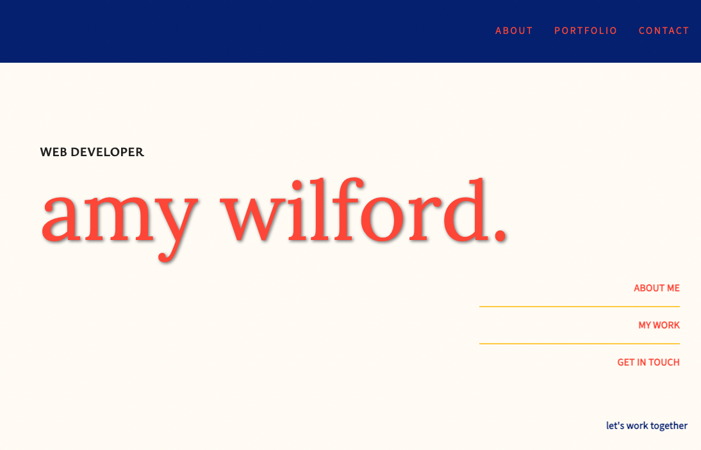

# Developer Portfolio: Amy Wilford - Full Stack Web Developer

 

## Table of contents

- [Description](#Description)
- [Technologies](#Technologies)
- [Usage-Installation](#Usage-Installation)
- [Demo](#Demo)

## Description
My personal portfolio featuring a selection of my deployed projects, featuring front-end,  fullstack, and wordpress development work to showcase the span of my collected skills. If you'd like to learn more about me and see what I can do - a copy of my resume and contact details are available on the deployed site. For further questions, you can reach out to me on github (https://github.com/AmyWilford)

## Technologies

This project was built using:

- Bootstrap
- CSS
- JavaScript
- Node.js
- React.js & JSX

## Launched Site
[Visit my portofilo](#https://amywilford.github.io/aw-portfolio/)
